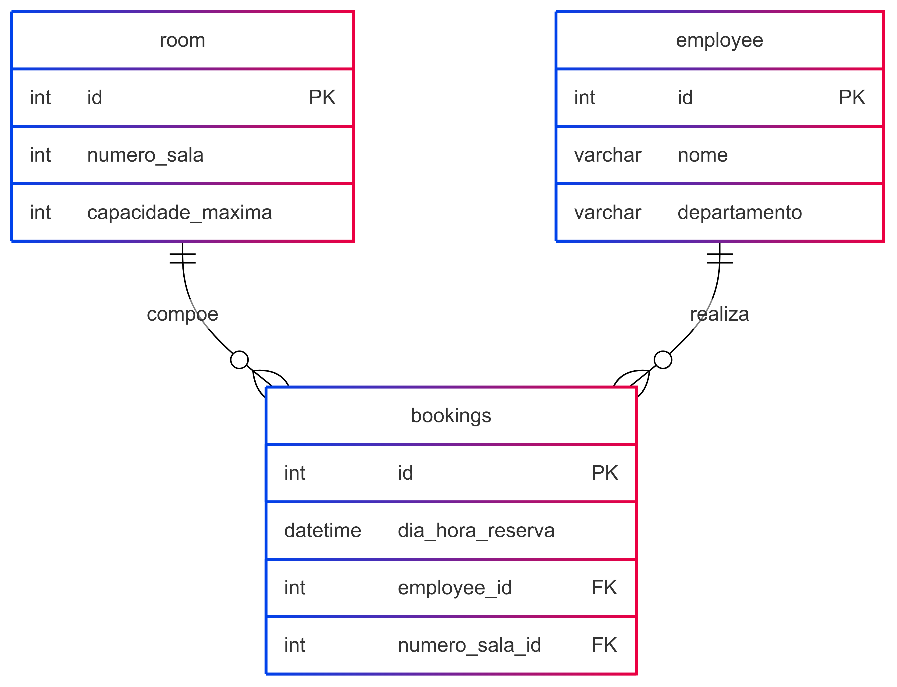

# Reserva de salas

## Introdução
Este projeto tem como objetivo oferecer uma solução eficiente para a reserva de salas de reunião por colaboradores de uma empresa. A aplicação foi desenvolvida para otimizar a gestão de espaços compartilhados, permitindo aos usuários visualizar a disponibilidade em tempo real, agendar reservas de forma prática e evitar conflitos de uso. Com isso, busca-se resolver problemas comuns relacionados à previsão e ocupação de salas, promovendo um ambiente de trabalho mais organizado e produtivo.

## Modelo relacional do banco de dados

  
 


## Modelo físico do banco de dados

```
CREATE TABLE IF NOT EXISTS employee (
  id SERIAL PRIMARY KEY,
  nome VARCHAR(100) NOT NULL,
  departamento VARCHAR(100) NOT NULL
);

CREATE TABLE IF NOT EXISTS room (
  id SERIAL PRIMARY KEY,
  numero_sala INTEGER NOT NULL UNIQUE,
  capacidade_maxima INTEGER NOT NULL
);

CREATE TABLE IF NOT EXISTS bookings (
  employee_id INTEGER NOT NULL,
  room_id INTEGER NOT NULL,
  dia_hora_reserva timestamp NOT NULL,
  PRIMARY KEY (employee_id, room_id),
  FOREIGN KEY (employee_id) REFERENCES employee(id),
  FOREIGN KEY (room_id) REFERENCES room(id)
);
```